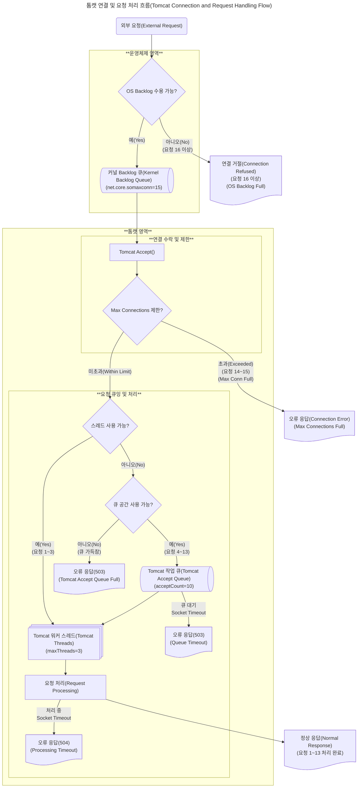

이전 TIL에서 서버 과부하에 대한 원인과 현상에 대해서 확인했습니다.

서버 과부하가 발생되는 주 이유는 요청보다 응답이 느리기 때문입니다.

응답이 느린 이유는 디스크 I/O 속도가 클라이언트의 요청 속도보다 매우 매우 매우 ~ 느리기 때문입니다.

하지만 단순히 데이터베이스의 응답이 지연되어 서버 과부하가 오는 것은 아닙니다.

이제는 웹 요청이 과도하게 들어올 경우 웹 서버는 어떻게 동작하는지 확인해보겠습니다.

# 운영체제와 웹서버의 요청 flowchart

## 정상적인 흐름

**운영체제는 연결을 시도한다.**

클라이언트(브라우저, API) 요청이 들어오면 운영체제는 클라이언트와 연결을 시도하게 됩니다.

클라이언트의 정보와 서버의 정보가 일치하는지 확인하고 TCP/IP 패킷일 경우 3-handshake를 통해 논리적인 연결을 하게 됩니다.

**운영체제는 연결된 후 커널 backlog 큐에 저장한다.**

~~운영체제는 클라이언트와 연결되면 전달받은 정보 패킷을 뜯습니다.~~

~~패킷에 도착지 포트번호를 확인하고 프로세스중 일치하는 포트번호가 있는지 확인합니다.~~

~~일치하는 포트번호가 있다면 해당 포트번호로 `커널 Backlog 큐`에 push합니다.~~

운영체제는 커널에서 포트 매칭 후 연결 객체(socket struct)를 backlog Queue에 push() 합니다.

> backlog Queue
>
> backlog는 **밀린 일, 처리 대기 중인 항목들**을 의미합니다.
>
> + 비즈니스에서 "작업 백로그"는 아직 완료되지 않는 작업 목록
> + 네트워크에서는 "수신은 됐지만 아직 처리되지 않은 연결 요청들"
>
> 그러면 OS에서 backlog queue는 무슨 역할일까?
>
> 클라이언트가 서버에 연결을 요청했지만, 서버 애플리케이션(예: 톰캣)이 아직 그 연결을 accept()`받아들이지` 하지 않았을 때,
>
> **운영체제가 임시로 대기시키는 큐**를 말합니다.
>
> 연결은 들어왔지만, 서버가 아직 받아들이지 않은 상태가 쌓이는 곳입니다.

**톰캣은 소켓을 받아드릴 수 있는지 확인한다.**

`accept()`를 호출하여 소켓을 받아드리기 직전에 현재 연결된 커넥트 수를 확인합니다.

`currentConnectionCount`를 확인합니다.

만약 이 수치가 `maxConnections`이상이면 `accept()`를 보류하거나 거절합니다.

> 커넥션 수를 관리하는 저 변수는 `volatile`로 되어있습니다

~~이때 커널 영역에 있는 소켓 정보를 운영체제가 톰캣 가상 메모리 영역에 복사를 합니다.~~

운영체제는 TCP 연결되면 accept() 하고 그 연결로 데이터를 읽고 쓰고 할 수 있는 FD(파일 디스크립트)를 생성합니다.

예를 들어 fd = 7 로 반환이 되며 이 정보를 가지고 통신할 수 있는 소켓 자원이 됩니다.

톰캣은 이 fd = 7 을 가지고 InputStream, outputStream, close를 하게 됩니다.

> 목욕탕으로 비유합니다
>
> 1. **운영체제(관리자)** 가 네가 들어오자마자 **사물함 키(정수형 FD)** 하나를 줍니다.
> 2. 손님은 그 **번호 하나만 기억**하면 됩니다 — 사물함 위치, 재질, 내부 구조는 몰라도 됩니다.
> 3. 필요한 만큼 **옷을 넣고(쓰기), 꺼내고(읽기)**
> 4. 다 쓰면 **키 반납(close)**
>
> 그래서  여러 요청이 오면 키를 하나씩 발급 받는 구조다.

톰캣은  `Thread Pool`을 조회합니다.

스레드 풀에 워커 스레드를 꺼낼 수 있는지 확인합니다.

스레드 풀은 워커 스레드를 꺼낼 수 없는 경우 대기표를 뽑기 위해 `Accept Queue`를 확인합니다.

큐 공간이 여유가 없는 경우 에러가 발생됩니다. `503 Tomcat Accept Queue Full`

큐 공간에 여유가 있는 경우는 큐 공간에 `push(socket)`을 하게 됩니다.

큐 공간에 들어갔다고 하더라도 대기가 길어지면 오류가 발생되면서 `Queue`에 대기중인 쓰레드들은 하나씩 `TimeOut`으로 요청이 종료됩니다.

큐 공간에서 꺼내옵니다. 워커 스레드 하나를 가져와서 사용자 요청 정보를 처리하게 됩니다.

이때 사용자 요청 처리가 길어지는 경우 `Processing Timeout`으로 예외가 발생하게 됩니다.

그 외에는 정상 응답처리가 됩니다.

## 병목 흐름

병목 흐름은 요청 흐름 순서대로 병목 지점을 추적해보려고 합니다.

TCP → WAS → JDBC → SQL 방식으로 서로 다른 영역을 통신할 때 발생하는 것을 예상할 수 있습니다.

그리고 정책에 따라 요청을 경쟁 상태 또는 준비 큐 같은 큐 구조(`Ready Queue`)에 저장하여 순차적으로 요청을 처리하는 경우도 있습니다.

### 운영체제와 WAS API 병목

운영체제와 톰캣 사이에 병목이 일어날 수 있는 구간을 정리해보려고 합니다.

운영체제는 클라이언트의 요청을 확인하면 `TCP 연결`을 하게 됩니다. 논리적인 연결이 성공하게 되면 커널은 클라이언트와 통신할 수 있는 파일 디스크립터(FD)를 만들게 됩니다.

FD는 커널 메모리 영역에 존재하며 운영체제 내 설정으로 최대 갯수를 지정할 수 있습니다.

위 순서도는 결과 처리에 대한 간단한 예제를 보여줍니다.

#### 간단 정리

| 상태 | OS FD | 톰캣 처리 여유 | 결과                                |
| ---- | ----- | -------------- | ----------------------------------- |
| ✅    | ❌     | ✅              | `Too many open files` (accept 실패) |
| ✅    | ✅     | ❌              | `503`, `Timeout` (큐/스레드 병목)   |
| ❌    | ❌     | ❌              | `Connection refused`, `Timeout`     |

### WAS 내 병목

