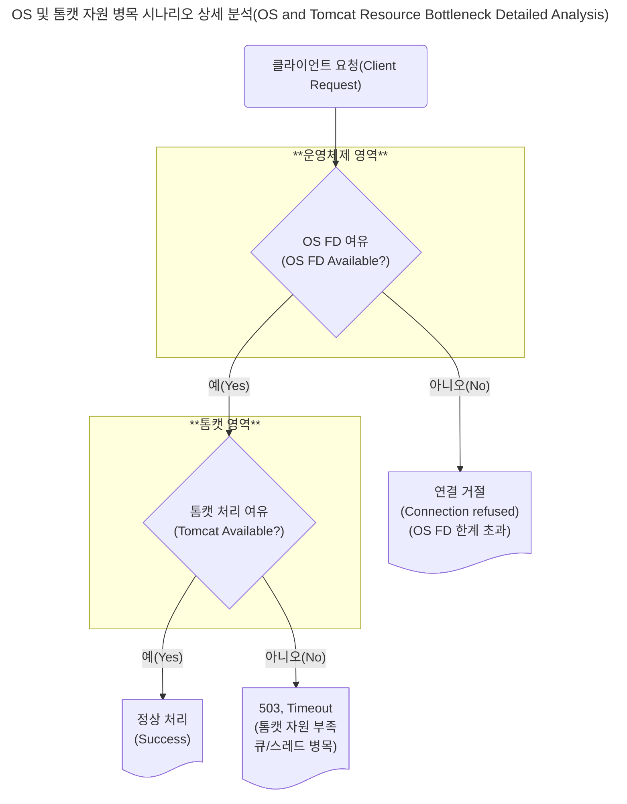
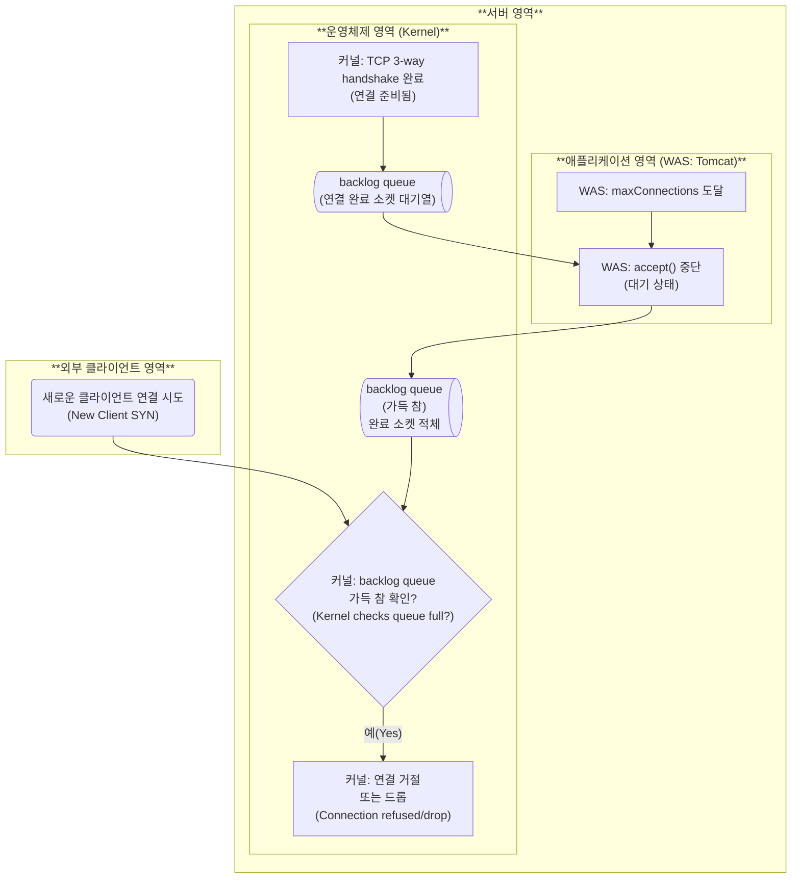

이전 TIL에서 서버 과부하에 대한 원인과 현상에 대해서 확인했습니다.

서버 과부하가 발생되는 주 이유는 요청보다 응답이 느리기 때문입니다.

응답이 느린 이유는 디스크 I/O 속도가 클라이언트의 요청 속도보다 매우 매우 매우 ~ 느리기 때문입니다.

하지만 단순히 데이터베이스의 응답이 지연되어 서버 과부하가 오는 것은 아닙니다.

이제는 웹 요청이 과도하게 들어올 경우 웹 서버는 어떻게 동작하는지 확인해보겠습니다.

# 운영체제와 웹서버의 요청 flowchart

## 정상적인 흐름

**운영체제는 연결을 시도한다.**

클라이언트(브라우저, API) 요청이 들어오면 운영체제는 클라이언트와 연결을 시도하게 됩니다.

클라이언트의 정보와 서버의 정보가 일치하는지 확인하고 TCP/IP 패킷일 경우 3-handshake를 통해 논리적인 연결을 하게 됩니다.

**운영체제는 연결된 후 커널 backlog 큐에 저장한다.**

~~운영체제는 클라이언트와 연결되면 전달받은 정보 패킷을 뜯습니다.~~

~~패킷에 도착지 포트번호를 확인하고 프로세스중 일치하는 포트번호가 있는지 확인합니다.~~

~~일치하는 포트번호가 있다면 해당 포트번호로 `커널 Backlog 큐`에 push합니다.~~

운영체제는 커널에서 포트 매칭 후 연결 객체(socket struct)를 backlog Queue에 push() 합니다.

> backlog Queue
>
> backlog는 **밀린 일, 처리 대기 중인 항목들**을 의미합니다.
>
> + 비즈니스에서 "작업 백로그"는 아직 완료되지 않는 작업 목록
> + 네트워크에서는 "수신은 됐지만 아직 처리되지 않은 연결 요청들"
>
> 그러면 OS에서 backlog queue는 무슨 역할일까?
>
> 클라이언트가 서버에 연결을 요청했지만, 서버 애플리케이션(예: 톰캣)이 아직 그 연결을 accept()`받아들이지` 하지 않았을 때,
>
> **운영체제가 임시로 대기시키는 큐**를 말합니다.
>
> 연결은 들어왔지만, 서버가 아직 받아들이지 않은 상태가 쌓이는 곳입니다.

**톰캣은 소켓을 받아드릴 수 있는지 확인한다.**

`accept()`를 호출하여 소켓을 받아드리기 직전에 현재 연결된 커넥트 수를 확인합니다.

`currentConnectionCount`를 확인합니다.

만약 이 수치가 `maxConnections`이상이면 `accept()`를 보류하거나 거절합니다.

> 커넥션 수를 관리하는 저 변수는 `volatile`로 되어있습니다

~~이때 커널 영역에 있는 소켓 정보를 운영체제가 톰캣 가상 메모리 영역에 복사를 합니다.~~

운영체제는 TCP 연결되면 accept() 하고 그 연결로 데이터를 읽고 쓰고 할 수 있는 FD(파일 디스크립트)를 생성합니다.

예를 들어 fd = 7 로 반환이 되며 이 정보를 가지고 통신할 수 있는 소켓 자원이 됩니다.

톰캣은 이 fd = 7 을 가지고 InputStream, outputStream, close를 하게 됩니다.

> 목욕탕으로 비유합니다
>
> 1. **운영체제(관리자)** 가 네가 들어오자마자 **사물함 키(정수형 FD)** 하나를 줍니다.
> 2. 손님은 그 **번호 하나만 기억**하면 됩니다 — 사물함 위치, 재질, 내부 구조는 몰라도 됩니다.
> 3. 필요한 만큼 **옷을 넣고(쓰기), 꺼내고(읽기)**
> 4. 다 쓰면 **키 반납(close)**
>
> 그래서  여러 요청이 오면 키를 하나씩 발급 받는 구조다.

톰캣은  `Thread Pool`을 조회합니다.

스레드 풀에 워커 스레드를 꺼낼 수 있는지 확인합니다.

스레드 풀은 워커 스레드를 꺼낼 수 없는 경우 대기표를 뽑기 위해 `Accept Queue`를 확인합니다.

큐 공간이 여유가 없는 경우 에러가 발생됩니다. `503 Tomcat Accept Queue Full`

큐 공간에 여유가 있는 경우는 큐 공간에 `push(socket)`을 하게 됩니다.

큐 공간에 들어갔다고 하더라도 대기가 길어지면 오류가 발생되면서 `Queue`에 대기중인 쓰레드들은 하나씩 `TimeOut`으로 요청이 종료됩니다.

큐 공간에서 꺼내옵니다. 워커 스레드 하나를 가져와서 사용자 요청 정보를 처리하게 됩니다.

이때 사용자 요청 처리가 길어지는 경우 `Processing Timeout`으로 예외가 발생하게 됩니다.

그 외에는 정상 응답처리가 됩니다.

## 병목 흐름

병목 흐름은 요청 흐름 순서대로 병목 지점을 추적해보려고 합니다.

TCP → WAS → JDBC → SQL 방식으로 서로 다른 영역을 통신할 때 발생하는 것을 예상할 수 있습니다.

그리고 정책에 따라 요청을 경쟁 상태 또는 준비 큐 같은 큐 구조(`Ready Queue`)에 저장하여 순차적으로 요청을 처리하는 경우도 있습니다.

### 운영체제와 FD 그리고 톰캣

운영체제와 톰캣 사이에 병목이 일어날 수 있는 구간을 정리해보려고 합니다.

운영체제는 클라이언트의 요청을 확인하면 `TCP 연결`을 하게 됩니다. 논리적인 연결이 성공하게 되면 커널은 클라이언트와 통신할 수 있는 파일 디스크립터(FD)를 만들게 됩니다.

FD는 커널 메모리 영역에 존재하며 운영체제 내 설정으로 최대 갯수를 지정할 수 있습니다.

위 순서도는 결과 처리에 대한 간단한 예제를 보여줍니다.

#### 간단 정리

| 상태 | OS FD | 톰캣 처리 여유 | 결과                                |
| ---- | ----- | -------------- | ----------------------------------- |
| ✅    | ❌     | ✅              | `Too many open files` (accept 실패) |
| ✅    | ✅     | ❌              | `503`, `Timeout` (큐/스레드 병목)   |
| ❌    | ❌     | ❌              | `Connection refused`, `Timeout`     |

네트워크 통신중 단일 서버에서 발생될 수 있는 제일 상단은 운영체제 영역입니다.

운영체제에서 FD는 네트워크, 파일 등 데이터를 읽고,쓰기를 할때 커널 메모리 영역에 임시 저장하는 장소를 말합니다.

#### 간단한 예시

FD는 파일 디스크립터로 헬스장 사물함과 유사합니다.

운영체제는 제한된 사물함을 가지고 있으며 회원들이 사물함을 요구하는 경우 남아있는 사물함중에서 선택해 전달합니다.

회원은 사물함  키를 열어 옷을 넣고, 옷을 보관하고, 옷을 꺼내고, 다시 반납합니다.

운영체제에서 네트워크 통신을 할 때에는 FD도 열쇠역할을 합니다.

FD와 연동된  `sendBuffer`, `receiveBuffer`가 있습니다.

클라이언트가 FD로 전달한 데이터를 `receiveBuffer`에 저장이 되며 서버가 전달할 데이터는 FD를 통해 `sendBuffer`에 저장됩니다.

클라이언트와 서버는 네트워크 통신을 위해서 운영체제의 FD(번호키)를 할당 받아야합니다.

그래서 FD를 반납하지 않게 된다면 점점 사용할 수 있는 FD가 한계가 낮아지면서 서버 지연이됩니다.

그외에 여러가지 사유로 운영체제는 병목이 될 수 있습니다.

+ I/O 블록킹, 버퍼 포화
+ 컨특스트 스위칭, 락 경합
+ 디스크 I/O 등..

### WAS 병목이 발생되는 주요 구간

1. **maxConnections** – 동시에 수용 가능한 최대 커넥션 수
2. **acceptCount** – 요청 처리 대기 큐 크기
3. **maxThreads** – 요청을 실제로 처리할 수 있는 워커 스레드 수

##### 커넥션 수용 한계 - maxConnections이 병목 구간이 될까?

클라이언트의 요청이 들어오면 커널에서 FD 만들고 소켓을 생성하고 톰캣은 받아들여야합니다.

그런데 동시에 들어오는 connections를 초과하면 새로운 연결을 받지 못하고 거절합니다.

이때 발생하는 현상이 `Connection refuesd`입니다. 사이트에 연결할 수 없다는 것입니다.

**처리량 제한으로 인한 과부하 거절**

서버의 자원(CPU, 메모리)이나 다른 자원에 여유가 있어도 `maxConnections`한계 때문에 새로운 클라이언트의 요청을 받을 수 없습니다. 

{: .img75 .align-center}

#### maxConnections는 수용인원을 표기하는 방식입니다.

maxConnections는 해당 놀이공원에서 수용할 수 있는 전체 인원 수 입니다.

1. 실제 놀이기구를 탈 수 있는 최대 인원수는 maxThread

2. 놀이기구를 타기 위해 대기줄에서 기다리는 인원수는 acceptCount

3. 놀이공원에 입장하여 대기줄에도 서지도 못하고 대기줄을 바라보는 인원수

1~3번의 총 인원수를 maxConnections입니다.

## GPT 퀴즈

### 상황 시나리오

**너는 한 물류 SaaS 서비스의 백엔드 개발자야.**
현재 운영 중인 Spring Boot + Tomcat 서버의 트래픽 현황은 다음과 같아:

- **QPS 평균**: 약 200
- **피크 QPS**: 이벤트 시간대 기준 900까지 상승
- **요청당 평균 처리 시간**: 80ms
- **KeepAlive 활성화 중** (평균 커넥션 유지 시간: 5초)
- **maxThreads**는 200으로 설정돼 있음
- 서버는 8코어 CPU, 16GB RAM
- OS의 FD 한도(`ulimit -n`)는 65536
- DB 커넥션 풀 최대: 100
- 로그에서 간헐적으로 503 오류가 관측되고 있음

------

### 🎯 퀴즈

#### ❓ Q1. 이 상황에서 `maxConnections`가 **1000 이하**로 설정되어 있다면, 어떤 현상이 발생할 수 있을까?

(복수 선택 가능)

A. CPU는 여유 있지만 요청 거절이 발생할 수 있다
B. DB가 먼저 터질 것이다
C. Connection refused가 증가할 수 있다
D. Thread 수는 충분하니 문제가 없다

**1차 답안**

평균인 경우

1초 모두 쓰레드 풀에 진입 남아 있는 쓰레드풀 0개 커넥션풀은 절반으로 나머지는 80ms 대기중 커넥션 연결수 200개

2초 모두 쓰레드 풀에 진입 남아 있는 쓰레드풀 0개 커넥션풀은 절반으로 나머지는 80ms 대기중 커넥션 연결수 400개

3초 모두 쓰레드 풀에 진입 남아 있는 쓰레드풀 0개 커넥션풀은 절반으로 나머지는 80ms 대기중 커넥션 연결수 600개

4초 모두 쓰레드 풀에 진입 남아 있는 쓰레드풀 0개 커넥션풀은 절반으로 나머지는 80ms 대기중 커넥션 연결수 800개

5초 모두 쓰레드 풀에 진입 남아 있는 쓰레드풀 0개 커넥션풀은 절반으로 나머지는 80ms 대기중 커넥션 연결수 1,000개

6초 모두 쓰레드 풀에 진입 남아 있는 쓰레드풀 0개 커넥션풀은 절반으로 나머지는 80ms 대기중 커넥션 연결수 1,000개 + backlog큐 대기

간헐적으로 503으로 Connection refused를 만날 수 있다.

따라서 A,C

피크인 경우

1초 모두 쓰레드 풀에 진입 남아 있는 쓰레드풀 0개 커넥션풀은  9번 회전해야하므로 총 소화시간 720ms 대기중 커넥션 연결수 900개

2초 모두 쓰레드 풀에 진입 남아 있는 쓰레드풀 0개 커넥션풀은  9번 회전해야하므로 총 소화시간 720ms 커넥션 연결수 1,000개 + backlog큐 대기

3초 모두 쓰레드 풀에 진입 남아 있는 쓰레드풀 0개 커넥션풀은 9번 회전해야하므로 총 소화시간 720ms 커넥션 연결수 1,000개 + backlog큐 대기

4초 모두 쓰레드 풀에 진입 남아 있는 쓰레드풀 0개 커넥션풀은 9번 회전해야하므로 총 소화시간 720ms 커넥션 연결수 1,000개 + backlog큐 대기

5초 모두 쓰레드 풀에 진입 남아 있는 쓰레드풀 0개 9번 회전해야하므로 총 소화시간 720ms 커넥션 연결수 1,000개 + backlog큐 대기

6초 모두 쓰레드 풀에 진입 남아 있는 쓰레드풀 0개 9번 회전해야하므로 총 소화시간 720ms 커넥션 연결수 1,000개 + backlog큐 대기

평균 응답속도가 80ms 이라면 초당 900개 요청이 오고 80ms당 100개르르 처리하므로 1초에 100개가 오더라도 쓰레드 풀이나 커넥션 풀은 모자르지 않습니다. 

다만 총 커넥션 연결 수 제한으로 인해 사용자 요청을 못받고 요청 타임아웃이나 backlog queqe에서 바로 거절되는 상황이 생긴다.

------

#### ❓ Q2. `maxConnections`를 **만약 10000으로 설정**한다면 어떤 리스크가 생길 수 있을까?

A. 서버가 더 많은 요청을 효율적으로 처리할 수 있다
B. 소켓이 과도하게 열려서 FD 한도를 초과할 수 있다
C. GC 압력이 올라갈 수 있다
D. 무조건 안정성이 올라간다

정답은 A,B,C 입니다.

maxConnections를 10,000으로 한다면 WAS는 운영체제가 backlog Queue에 보관하지 않고 모두 수용할 수 있습니다.

그리고 현재 상황에서 backlog Queue가 비어있을 확률이 높으므로 운영체제는 계속 FD를 발급하게 됩니다.

컴퓨터에 톰캣만 있는 것이 아니므로 파일이나 다른 I/O 작업을 위한 FD가 부족할 수 있습니다.

GC 압력도 올라갈 수 있습니다. KeepAlive가 평균 5초 이므로 커넥션마다 JVM에서 남아있는 데이터 정보가 있을 수 있기 때문입니다.

------

#### ❓ Q3. 이 상황에서 적절한 `maxConnections` 값을 설정하기 위해 **가장 먼저 고려해야 할 요소 2가지는?**

A. CPU 코어 수
B. 평균 커넥션 유지 시간 (KeepAlive)
C. maxThreads 수
D. DB 커넥션 풀 사이즈

정답은 B, C 라고 생각합니다.

이유는 최대 연결 수는 keep-alive 에 영향을 받기 때문입니다.

평균 커넥션 유지 시간이 길어질 수록 사용자는 요청을 보내지 않아도 커넥션은 유지되며 최대 연결 수에 포함됩니다.

커넥션 유지 시간이 길어지면 새로운 사용자의 요청을 받을 수 있도록 최대 연결 수를 늘려야하는 것을 고려하게 합니다

또한 최대 쓰레드의 수도 고려할 대상입니다. 최대 연결수와 최대 쓰레드의 수의 차이가 크고 그 사이 대기가 길어지게 된다면 JVM 자원도 차지하면서 사용자는 타임아웃까지 대기만하다가 종료가 됩니다. 또한 최대 연결수가 최대 쓰레드의 수보다 작게되면 쓰레드는 여유가 있어도 사용자의 요청 차단이 될 수 있기 때문입니다.

